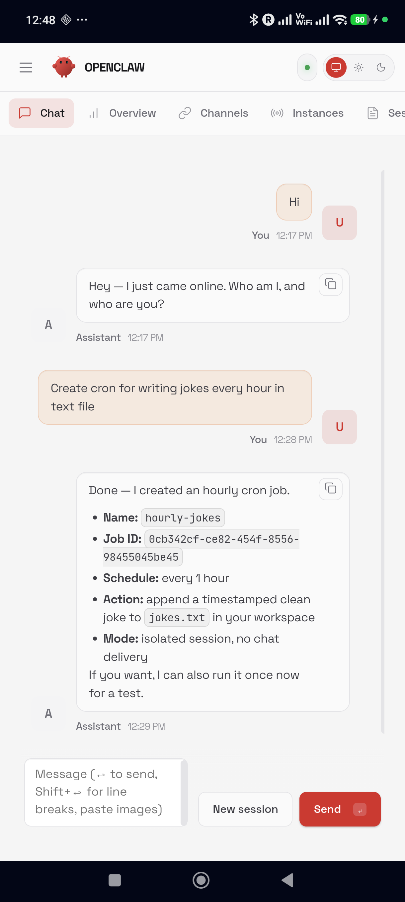
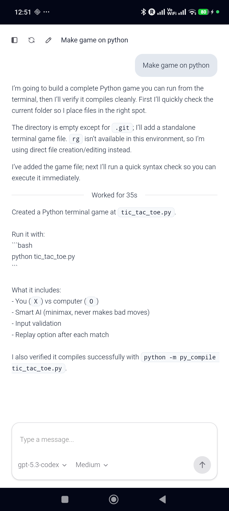

<div align="center">

# AnyClaw

### OpenClaw + Codex — Running Natively on Android

[](https://developer.android.com)
[](https://openclaw.ai)
[](https://github.com/openai/codex)
[](https://nodejs.org)
[](https://kotlinlang.org)
[](LICENSE)

<br />

> **A self-contained Android APK that bundles OpenClaw + OpenAI Codex CLI**
> **with a complete Linux environment. Two AI agents, one app, your pocket.**

<br />

[Download APK](https://friuns2.github.io/openclaw-android-assistant/) ·
[OpenClaw Docs](https://docs.openclaw.ai) ·
[Project Spec](PROJECT_SPEC.md)

<br />

 &nbsp;&nbsp; 

</div>

---

## What Is This?

This project puts two AI coding agents on your Android phone in a single APK:

- **[OpenClaw](https://openclaw.ai)** — a personal AI assistant with multi-channel support, agent routing, skills, Canvas, and a full Control UI dashboard
- **[OpenAI Codex CLI](https://github.com/openai/codex)** — a terminal-based coding agent that reads your codebase, writes code, and runs commands

Both run inside an embedded Linux environment extracted from the APK. No root required. No Termux dependency. Everything is self-contained.

The app authenticates once via OpenAI OAuth, and both agents share the same credentials. OpenClaw uses `openai-codex/gpt-5.3-codex` by default; Codex CLI uses its own `codex app-server` backend.

---

## What Can You Do?

| | Feature | Description |
|---|---|---|
| | **OpenClaw Dashboard** | Full Control UI accessible from the sidebar — chat, agents, sessions, skills |
| | **Codex Chat** | Conversational coding agent with streaming responses and reasoning visibility |
| | **Execute Commands** | Both agents run shell commands in the embedded Linux environment |
| | **Multi-Thread Sessions** | Parallel conversations, each with its own context and working directory |
| | **Full Auto-Approval** | No permission popups — `danger-full-access` mode by default |
| | **Background Execution** | Foreground service keeps everything alive when you switch apps |
| | **OAuth Login** | One-time browser-based OpenAI auth — shared between both agents |
| | **Offline Bootstrap** | Linux environment extracted from APK — works without internet after setup |

---

## Quick Start

```bash
git clone https://github.com/friuns2/openclaw-android-assistant.git
cd openclaw-android-assistant

npm install && npm run build

cd android && bash scripts/download-bootstrap.sh
bash scripts/build-server-bundle.sh && ./gradlew assembleDebug

adb install -r app/build/outputs/apk/debug/app-debug.apk
adb shell am start -n com.codex.mobile/.MainActivity
```

Or [download the latest APK](https://friuns2.github.io/openclaw-android-assistant/) directly.

---

## Architecture

```
┌──────────────────────────────────────────────────────────┐
│                      Android APK                          │
│                                                           │
│  ┌────────────┐  ┌──────────────────────────────────────┐ │
│  │  WebView   │  │  APK Assets                          │ │
│  │  (Vue.js)  │  │  bootstrap-aarch64.zip               │ │
│  └─────┬──────┘  │  server-bundle/ (Vue + Express)      │ │
│        │         │  proxy.js / bionic-compat.js          │ │
│        │         └──────────────────────────────────────┘ │
│  ┌─────▼────────────────────────────────────────────────┐ │
│  │             CodexServerManager                        │ │
│  │  Bootstrap → Node.js → Codex + OpenClaw → Auth        │ │
│  │  Proxy → Gateway → Control UI → Web Server            │ │
│  └─────┬────────────────────────────────────────────────┘ │
│        │                                                  │
│  ┌─────▼────────────────────────────────────────────────┐ │
│  │             Embedded Linux ($PREFIX)                   │ │
│  │                                                       │ │
│  │  codex-web-local   → :18923 (HTTP, WebView target)    │ │
│  │    └─ codex app-server (native Rust/musl, JSON-RPC)   │ │
│  │                                                       │ │
│  │  openclaw gateway  → :18789 (WebSocket)               │ │
│  │  openclaw ctrl UI  → :19001 (static file server)      │ │
│  │                                                       │ │
│  │  proxy.js          → :18924 (CONNECT proxy, DNS/TLS)  │ │
│  └───────────────────────────────────────────────────────┘ │
└──────────────────────────────────────────────────────────┘
```

### Services

| Port | Service | Purpose |
|------|---------|---------|
| 18789 | OpenClaw Gateway | WebSocket control plane for agents, sessions, tools |
| 18923 | codex-web-local | HTTP server with Vue.js UI (WebView target) |
| 18924 | CONNECT Proxy | DNS/TLS bridge for musl-linked Codex binary |
| 19001 | Control UI Server | Static file server for OpenClaw dashboard |

---

## OpenClaw Integration

OpenClaw is installed alongside Codex and runs as a WebSocket gateway on the device. The installation is complex because OpenClaw depends on `koffi` (a native FFI module) which requires a full C/C++ toolchain to build from source on Android.

### Build Pipeline

1. **Build dependencies** — Downloads ~20 Termux packages (clang, cmake, make, lld, NDK sysroot, libllvm, etc.)
2. **Fixes** — Rewrites git-core shebangs, binary-patches `make`/`cmake` to replace hardcoded Termux shell paths with `/system/bin/sh`, creates stub headers (`spawn.h`, `android/api-level.h`, `renameat2_shim.h`)
3. **npm install** — `npm install -g --ignore-scripts openclaw@latest` (689 packages, skip native builds)
4. **koffi build** — Builds the native FFI module separately with `CC=clang CXX=clang++ LDFLAGS="-fuse-ld=lld"`
5. **Path patching** — Rewrites `/tmp`, `/bin/sh`, `/bin/bash`, `/usr/bin/env` in all JS files to `$PREFIX/...`

### Auth Flow

Authentication is automatic from the existing Codex OAuth login:

- `configureOpenClawAuth()` writes `openclaw.json` with gateway token auth + `dangerouslyDisableDeviceAuth`
- The Codex `access_token` from `~/.codex/auth.json` is copied into `auth-profiles.json` as an `openai-codex:codex-cli` profile with `type: "token"`
- OpenClaw model is set to `openai-codex/gpt-5.3-codex` — uses the same OpenAI account, no separate API key needed
- Auth profiles are written to both global (`~/.openclaw/`) and agent-specific (`~/.openclaw/agents/main/agent/`) directories

### Android Compatibility

The `bionic-compat.js` shim (loaded via `NODE_OPTIONS="-r ..."`) patches:
- `process.platform` — returns `"linux"` instead of `"android"`
- `os.cpus()` — returns a valid CPU array (Android's `/proc/cpuinfo` format differs)
- `os.networkInterfaces()` — handles Android's interface naming

---

## How It Works

### Embedded Linux

The APK bundles Termux's `bootstrap-aarch64.zip` — a minimal Linux userland with `sh`, `apt-get`, `dpkg-deb`, SSL certificates, and core libraries. On first launch, it's extracted to the app's private storage at `$PREFIX = /data/user/0/com.codex.mobile/files/usr`.

### Native Codex Binary

The Codex CLI ships a 73MB native Rust binary compiled for `aarch64-unknown-linux-musl`. npm refuses to install it on Android, so we download the tarball directly from the npm registry and extract it manually.

### DNS/TLS Proxy

The musl-linked binary reads `/etc/resolv.conf` for DNS — which doesn't exist on Android. A Node.js CONNECT proxy on port 18924 bridges this: Node.js uses Android's Bionic DNS resolver, and the native binary routes all HTTPS through `HTTPS_PROXY`.

### W^X Bypass

Android 10+ enforces SELinux W^X (Write XOR Execute) policies. We use `targetSdk = 28` to bypass this, same approach as Termux (F-Droid).

---

## Startup Sequence

1. Battery optimization exemption + foreground service
2. Bootstrap extraction (Termux userland)
3. proot installation (package management)
4. Node.js installation (`apt-get download` + `dpkg-deb`)
5. Python installation
6. `bionic-compat.js` extraction
7. OpenClaw build deps + install + koffi build + path patching
8. Codex CLI + native platform binary installation
9. Full-access config (`approval_policy = "never"`)
10. CONNECT proxy startup
11. OAuth login (`codex login` via browser)
12. Health check (`codex exec "say hi"`)
13. OpenClaw auth config + gateway + Control UI server
14. codex-web-local server startup
15. WebView loads `http://127.0.0.1:18923/`

---

## Project Structure

```
android/
├── app/src/main/
│   ├── AndroidManifest.xml
│   ├── assets/
│   │   ├── proxy.js                 # CONNECT proxy (DNS/TLS bridge)
│   │   ├── bionic-compat.js         # Android platform shim
│   │   └── server-bundle/           # Pre-built Vue + Express + deps
│   └── java/com/codex/mobile/
│       ├── BootstrapInstaller.kt    # Linux environment setup
│       ├── CodexForegroundService.kt # Background persistence
│       ├── CodexServerManager.kt    # Install, auth, proxy, OpenClaw, server
│       └── MainActivity.kt         # WebView + setup orchestration
├── scripts/
│   ├── download-bootstrap.sh        # Fetch Termux bootstrap
│   └── build-server-bundle.sh       # Bundle frontend into APK assets
src/                                  # codex-web-local (TypeScript + Vue)
├── api/                              # RPC client, gateway, SSE
├── components/                       # Vue components (composer, threads, sidebar)
├── composables/                      # useDesktopState (reactive state)
├── server/                           # Express + codex app-server bridge
└── cli/                              # CLI entry point
```

---

## Requirements

- **Android 7.0+** (API 24) — ARM64 device
- **Internet connection** — for first-run setup + API calls
- **OpenAI account** — authenticated via OAuth browser flow
- **~500MB storage** — for Linux environment + Node.js + Codex + OpenClaw + build tools

---

## Tech Stack

| Layer | Technology | Version |
|---|---|---|
| AI Gateway | OpenClaw | 2026.2.21-2 |
| AI Agent | OpenAI Codex CLI | 0.104.0 |
| Model | gpt-5.3-codex (via Codex OAuth) | - |
| Runtime | Node.js (via Termux) | 24.13.0 |
| Build Tools | Clang/LLVM, CMake, Make, LLD | 21.1.8 / 4.2.3 |
| Frontend | Vue.js 3 + Vite + TailwindCSS | 3.x |
| Backend | Express.js + JSON-RPC bridge | - |
| Android | Kotlin + WebView | 2.1.0 |
| Linux | Termux bootstrap (aarch64) | - |

---

## Troubleshooting

| Problem | Solution |
|---|---|
| App crashes on launch | Check `adb logcat \| grep CodexServerManager` |
| "Permission denied" executing binaries | Ensure `targetSdk = 28` in `build.gradle.kts` |
| OpenClaw gateway fails to start | Check `~/.openclaw/openclaw.json` config and auth-profiles |
| koffi build fails | Verify clang/cmake/make are installed and binary-patched |
| "No address associated with hostname" | Check internet; CONNECT proxy may not be running |
| Login page doesn't open | Ensure a default browser is set on the device |
| App killed in background | Grant battery optimization exemption in Android settings |

---

## Credits

- [OpenClaw](https://openclaw.ai) — Personal AI assistant by Peter Steinberger and community
- [OpenAI Codex CLI](https://github.com/openai/codex) — Terminal-based coding agent
- [AidanPark/openclaw-android](https://github.com/AidanPark/openclaw-android) — Android patches and bionic-compat.js
- [Termux](https://termux.dev) — Linux environment bootstrap for Android

---

<div align="center">

**Two AI agents. One APK. Your pocket.**

[Download APK](https://friuns2.github.io/openclaw-android-assistant/) · [OpenClaw Docs](https://docs.openclaw.ai) · [Project Spec](PROJECT_SPEC.md)

</div>
