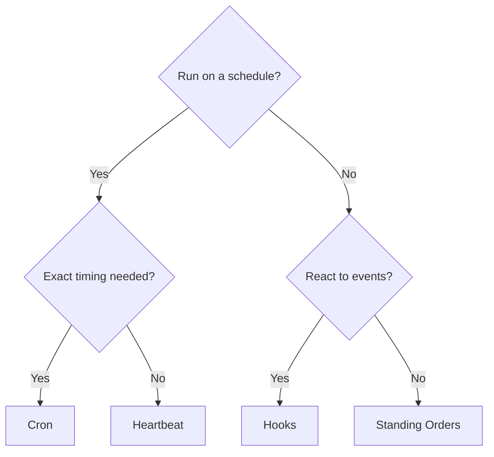

# Automation

OpenClaw provides several automation mechanisms, each suited to different use cases. This page helps you choose the right one.

## Quick decision guide

## Mechanisms at a glance

| Mechanism                                      | What it does                                             | Runs in                  | Creates task record |
| ---------------------------------------------- | -------------------------------------------------------- | ------------------------ | ------------------- |
| [Heartbeat](/gateway/heartbeat)                | Periodic main-session turn — batches multiple checks     | Main session             | No                  |
| [Cron](/automation/cron-jobs)                  | Scheduled jobs with precise timing                       | Main or isolated session | Yes (all types)     |
| [Background Tasks](/automation/tasks)          | Tracks detached work (cron, ACP, subagents, CLI)         | N/A (ledger)             | N/A                 |
| [Hooks](/automation/hooks)                     | Event-driven scripts triggered by agent lifecycle events | Hook runner              | No                  |
| [Standing Orders](/automation/standing-orders) | Persistent instructions injected into the system prompt  | Main session             | No                  |
| [Webhooks](/automation/webhook)                | Receive inbound HTTP events and route to the agent       | Gateway HTTP             | No                  |

### Specialized automation

| Mechanism                                      | What it does                                    |
| ---------------------------------------------- | ----------------------------------------------- |
| [Gmail PubSub](/automation/gmail-pubsub)       | Real-time Gmail notifications via Google PubSub |
| [Polling](/automation/poll)                    | Periodic data source checks (RSS, APIs, etc.)   |
| [Auth Monitoring](/automation/auth-monitoring) | Credential health and expiry alerts             |

## How they work together

The most effective setups combine multiple mechanisms:

1. **Heartbeat** handles routine monitoring (inbox, calendar, notifications) in one batched turn every 30 minutes.
2. **Cron** handles precise schedules (daily reports, weekly reviews) and one-shot reminders.
3. **Hooks** react to specific events (tool calls, session resets, compaction) with custom scripts.
4. **Standing Orders** give the agent persistent context ("always check the project board before replying").
5. **Background Tasks** automatically track all detached work so you can inspect and audit it.

See [Cron vs Heartbeat](/automation/cron-vs-heartbeat) for a detailed comparison of the two scheduling mechanisms.

## TaskFlow

[TaskFlow](/automation/taskflow) is the flow orchestration substrate above background tasks. It manages durable multi-step flows with managed and mirrored sync modes, and exposes `openclaw tasks flow list|show|cancel` for inspection and recovery. See [TaskFlow](/automation/taskflow) for details.

## Related

- [Cron vs Heartbeat](/automation/cron-vs-heartbeat) — detailed comparison guide
- [TaskFlow](/automation/taskflow) — flow orchestration above tasks
- [Troubleshooting](/automation/troubleshooting) — debugging automation issues
- [Configuration Reference](/gateway/configuration-reference) — all config keys
