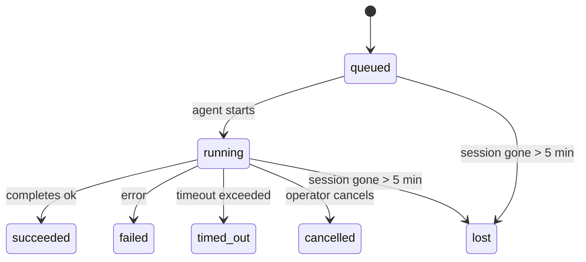

# Background Tasks

> **Cron vs Heartbeat vs Tasks?** See [Cron vs Heartbeat](/automation/cron-vs-heartbeat) for choosing the right scheduling mechanism. This page covers **tracking** background work, not scheduling it.

Background tasks track work that runs **outside your main conversation session**:
ACP runs, subagent spawns, isolated cron job executions, and CLI-initiated operations.

Tasks do **not** replace sessions, cron jobs, or heartbeats — they are the **activity ledger** that records what detached work happened, when, and whether it succeeded.

<Note>
Not every agent run creates a task. Heartbeat turns and normal interactive chat do not. All cron executions, ACP spawns, subagent spawns, and CLI agent commands do.
</Note>

## TL;DR

- Tasks are **records**, not schedulers — cron and heartbeat decide _when_ work runs, tasks track _what happened_.
- ACP, subagents, all cron jobs, and CLI operations create tasks. Heartbeat turns do not.
- Each task moves through `queued → running → terminal` (succeeded, failed, timed_out, cancelled, or lost).
- Completion notifications are delivered directly to a channel or queued for the next heartbeat.
- `openclaw tasks list` shows all tasks; `openclaw tasks audit` surfaces issues.
- Terminal records are kept for 7 days, then automatically pruned.

## Quick start

```bash
# List all tasks (newest first)
openclaw tasks list

# Filter by runtime or status
openclaw tasks list --runtime acp
openclaw tasks list --status running

# Show details for a specific task (by ID, run ID, or session key)
openclaw tasks show <lookup>

# Cancel a running task (kills the child session)
openclaw tasks cancel <lookup>

# Change notification policy for a task
openclaw tasks notify <lookup> state_changes

# Run a health audit
openclaw tasks audit
```

## What creates a task

| Source                 | Runtime type | When a task record is created                          | Default notify policy |
| ---------------------- | ------------ | ------------------------------------------------------ | --------------------- |
| ACP background runs    | `acp`        | Spawning a child ACP session                           | `done_only`           |
| Subagent orchestration | `subagent`   | Spawning a subagent via `sessions_spawn`               | `done_only`           |
| Cron jobs (all types)  | `cron`       | Every cron execution (main-session and isolated)       | `silent`              |
| CLI operations         | `cli`        | `openclaw agent` commands that run through the gateway | `done_only`           |

Main-session cron tasks use `silent` notify policy by default — they create records for tracking but do not generate notifications. Isolated cron tasks also default to `silent` but are more visible because they run in their own session.

**What does not create tasks:**

- Heartbeat turns — main-session; see [Heartbeat](/gateway/heartbeat)
- Normal interactive chat turns
- Direct `/command` responses

## Task lifecycle



| Status      | What it means                                                              |
| ----------- | -------------------------------------------------------------------------- |
| `queued`    | Created, waiting for the agent to start                                    |
| `running`   | Agent turn is actively executing                                           |
| `succeeded` | Completed successfully                                                     |
| `failed`    | Completed with an error                                                    |
| `timed_out` | Exceeded the configured timeout                                            |
| `cancelled` | Stopped by the operator via `openclaw tasks cancel`                        |
| `lost`      | Backing child session disappeared (detected after a 5-minute grace period) |

Transitions happen automatically — when the associated agent run ends, the task status updates to match.

## Delivery and notifications

When a task reaches a terminal state, OpenClaw notifies you. There are two delivery paths:

**Direct delivery** — if the task has a channel target (the `requesterOrigin`), the completion message goes straight to that channel (Telegram, Discord, Slack, etc.).

**Session-queued delivery** — if direct delivery fails or no origin is set, the update is queued as a system event in the requester's session and surfaces on the next heartbeat.

<Tip>
Task completion triggers an immediate heartbeat wake so you see the result quickly — you do not have to wait for the next scheduled heartbeat tick.
</Tip>

### Notification policies

Control how much you hear about each task:

| Policy                | What is delivered                                                       |
| --------------------- | ----------------------------------------------------------------------- |
| `done_only` (default) | Only terminal state (succeeded, failed, etc.) — **this is the default** |
| `state_changes`       | Every state transition and progress update                              |
| `silent`              | Nothing at all                                                          |

Change the policy while a task is running:

```bash
openclaw tasks notify <lookup> state_changes
```

## CLI reference

### `tasks list`

```bash
openclaw tasks list [--runtime <acp|subagent|cron|cli>] [--status <status>] [--json]
```

Output columns: Task ID, Kind, Status, Delivery, Run ID, Child Session, Summary.

### `tasks show`

```bash
openclaw tasks show <lookup>
```

The lookup token accepts a task ID, run ID, or session key. Shows the full record including timing, delivery state, error, and terminal summary.

### `tasks cancel`

```bash
openclaw tasks cancel <lookup>
```

For ACP and subagent tasks, this kills the child session. Status transitions to `cancelled` and a delivery notification is sent.

### `tasks notify`

```bash
openclaw tasks notify <lookup> <done_only|state_changes|silent>
```

### `tasks audit`

```bash
openclaw tasks audit [--json]
```

Surfaces operational issues. Findings also appear in `openclaw status` when issues are detected.

| Finding                   | Severity | Trigger                                               |
| ------------------------- | -------- | ----------------------------------------------------- |
| `stale_queued`            | warn     | Queued for more than 10 minutes                       |
| `stale_running`           | error    | Running for more than 30 minutes                      |
| `lost`                    | error    | Backing session is gone                               |
| `delivery_failed`         | warn     | Delivery failed and notify policy is not `silent`     |
| `missing_cleanup`         | warn     | Terminal task with no cleanup timestamp               |
| `inconsistent_timestamps` | warn     | Timeline violation (for example ended before started) |

## Status integration (task pressure)

`openclaw status` includes an at-a-glance task summary:

```
Tasks: 3 queued · 2 running · 1 issues
```

The summary reports:

- **active** — count of `queued` + `running`
- **failures** — count of `failed` + `timed_out` + `lost`
- **byRuntime** — breakdown by `acp`, `subagent`, `cron`, `cli`

## Storage and maintenance

### Where tasks live

Task records persist in SQLite at:

```
$OPENCLAW_STATE_DIR/tasks/runs.sqlite
```

The registry loads into memory at gateway start and syncs writes to SQLite for durability across restarts.

### Automatic maintenance

A sweeper runs every **60 seconds** and handles three things:

1. **Reconciliation** — checks if active tasks' backing sessions still exist. If a child session has been gone for more than 5 minutes, the task is marked `lost`.
2. **Cleanup stamping** — sets a `cleanupAfter` timestamp on terminal tasks (endedAt + 7 days).
3. **Pruning** — deletes records past their `cleanupAfter` date.

**Retention**: terminal task records are kept for **7 days**, then automatically pruned. No configuration needed.

## How tasks relate to other systems

### Tasks and ClawFlow

ClawFlow is the flow layer above tasks. A flow groups one or more task runs into a single job, owns the parent session context, and gives you a higher-level control surface for blocked or multi-step work.

See [ClawFlow](/automation/clawflow) for the flow overview and [CLI: flows](/cli/flows) for the command surface.

### Tasks and cron

A cron job **definition** lives in `~/.openclaw/cron/jobs.json`. **Every** cron execution creates a task record — both main-session and isolated. Main-session cron tasks default to `silent` notify policy so they track without generating notifications.

See [Cron Jobs](/automation/cron-jobs).

### Tasks and heartbeat

Heartbeat runs are main-session turns — they do not create task records. When a task completes, it can trigger a heartbeat wake so you see the result promptly.

See [Heartbeat](/gateway/heartbeat).

### Tasks and sessions

A task may reference a `childSessionKey` (where work runs) and a `requesterSessionKey` (who started it). Sessions are conversation context; tasks are activity tracking on top of that.

### Tasks and agent runs

A task's `runId` links to the agent run doing the work. Agent lifecycle events (start, end, error) automatically update the task status — you do not need to manage the lifecycle manually.

## Related

- [Automation Overview](/automation) — all automation mechanisms at a glance
- [ClawFlow](/automation/clawflow) — job-level orchestration above tasks
- [Cron Jobs](/automation/cron-jobs) — scheduling background work
- [Cron vs Heartbeat](/automation/cron-vs-heartbeat) — choosing the right mechanism
- [Heartbeat](/gateway/heartbeat) — periodic main-session turns
- [CLI: flows](/cli/flows) — flow inspection and control commands
- [CLI: Tasks](/cli/index#tasks) — CLI command reference
